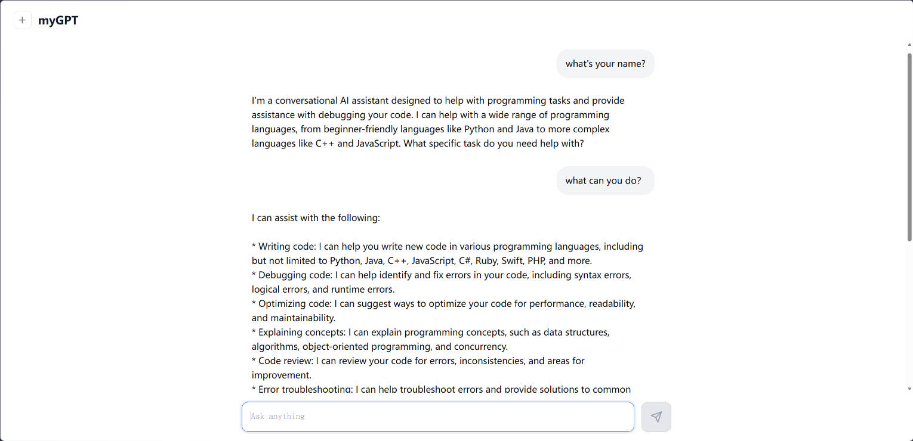
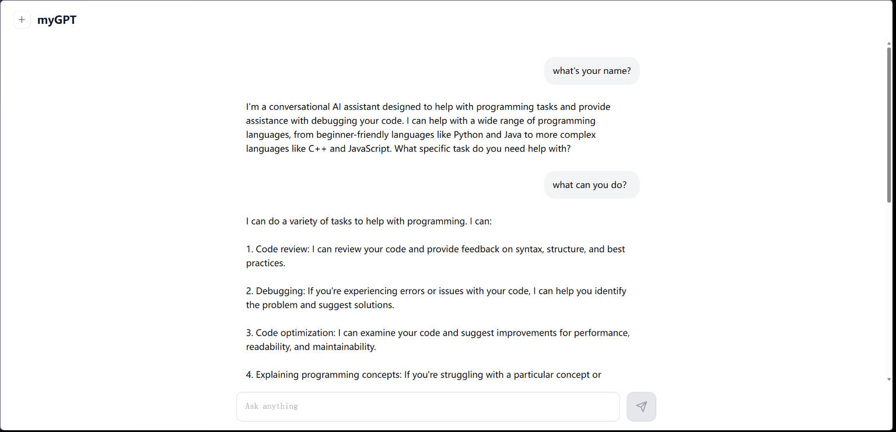
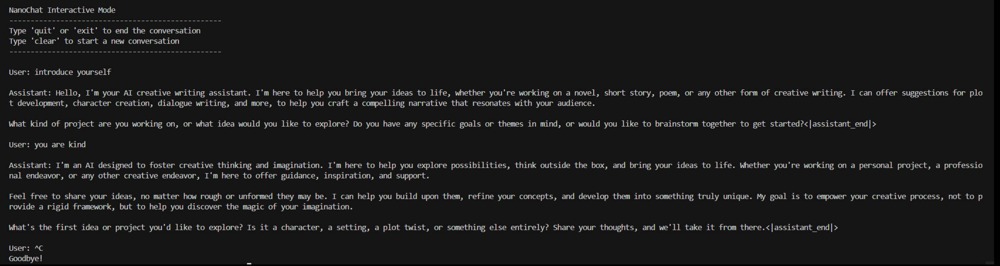

# NanoChat - A Minimal Full-Stack ChatGPT Clone

NanoChat 是一个从零开始构建的完整 ChatGPT 复刻项目，涵盖了 **Tokenizer 训练 → 预训练 → SFT 对话微调 → 推理部署** 的全流程。基于 GPT 架构，实现了包括 RoPE、Flash Attention 3、Grouped Query Attention、Value Embedding (ResFormer) 等现代 LLM 训练技术。

## 项目亮点

- **完整训练流水线**：BPE Tokenizer 训练 → 大规模预训练 (FineWeb-Edu 100B) → 监督微调 (SFT)
- **现代模型架构**：RoPE 旋转位置编码、QK Norm、GQA、Relu² 激活、Value Embedding、滑动窗口注意力
- **高效训练**：支持多 GPU DDP 分布式训练、Muon + AdamW 混合优化器、Flash Attention 3
- **推理引擎**：KV Cache 加速推理、内置 Python 计算器工具调用
- **多种交互方式**：Web UI 聊天界面 + CLI 命令行聊天

## 模型架构

| 参数 | 值 |
|------|-----|
| 模型层数 (Depth) | 26 |
| 隐藏维度 (n_embd) | 768 |
| 注意力头数 | 6 |
| KV 头数 (GQA) | 6 |
| 词表大小 | 32,768 |
| 最大序列长度 | 2,048 |
| 滑动窗口模式 | SSSL |
| 总参数量 | ~1.68B |
| 激活函数 | ReLU² |
| 位置编码 | RoPE |

### 架构特性

- **旋转位置编码 (RoPE)**：无可学习位置嵌入
- **QK Norm**：对 Query/Key 做 RMSNorm 稳定训练
- **词嵌入与 lm_head 不共享权重 (Untied)**
- **MLP 使用 ReLU² 激活**
- **RMSNorm 无可学习参数**
- **所有 Linear 层无 bias**
- **Value Embedding (ResFormer)**：交替层使用输入相关门控混合 Value Embedding
- **滑动窗口注意力**：SSSL 模式（3层短窗口 + 1层长窗口交替）

## 训练详情

### 预训练

| 指标 | 值 |
|------|-----|
| 训练数据 | FineWeb-Edu 100B |
| 训练 Tokens | ~7.8B |
| Tokens/参数比 | 8.5x |
| 训练 FLOPs | 4.83 × 10¹⁹ |
| MFU | 45.86% |
| 训练时间 | ~702 分钟 (8×GPU) |
| 峰值显存 | ~74 GB |
| 最终验证 BPB | 0.7433 |
| CORE 指标 | 0.2680 |

### SFT 对话微调

| 指标 | 值 |
|------|-----|
| 基座模型 | d26 (预训练最终 checkpoint) |
| 训练迭代 | 747 |
| 批次大小 | 524,288 tokens |
| 最低验证 BPB | 0.3245 |

### Tokenizer

| 指标 | 值 |
|------|-----|
| 类型 | BPE (RustBPE) |
| 词表大小 | 32,768 |
| 特殊 Token 数 | 9 |
| 训练语料 | 2B characters |
| 训练时间 | ~74 秒 |

## 效果展示

### Web 聊天界面



NanoChat 提供 Web 端聊天界面，支持流式输出，具备代码审查、调试、优化、概念解释等多种编程辅助能力。

### CLI 命令行聊天



支持命令行终端交互模式，方便开发者快速测试和调试模型。

### 创意写作模式



内置创意写作等多种角色模式，模型能根据不同的系统提示展现出差异化的交互风格。

## 项目结构

```
nanochat/
├── nanochat/                    # 核心库
│   ├── gpt.py                  # GPT 模型定义 (架构、前向传播、生成)
│   ├── engine.py               # 推理引擎 (KV Cache、工具调用)
│   ├── flash_attention.py      # Flash Attention 3 / SDPA 自动切换
│   ├── tokenizer.py            # BPE Tokenizer (训练 + 推理)
│   ├── dataset.py              # 预训练数据集加载 (FineWeb-Edu)
│   ├── dataloader.py           # 数据加载器
│   ├── checkpoint_manager.py   # Checkpoint 保存/加载
│   ├── optim.py                # Muon + AdamW 混合优化器
│   ├── loss_eval.py            # 损失计算与评估
│   ├── common.py               # 公共工具 (分布式、日志)
│   ├── report.py               # 训练报告生成
│   └── ui.html                 # Web 聊天 UI 模板
├── scripts/                     # 运行脚本
│   ├── base_train.py           # 预训练启动脚本
│   ├── chat_sft.py             # SFT 微调脚本
│   ├── chat_cli.py             # CLI 聊天脚本
│   ├── chat_web.py             # Web 聊天服务
│   ├── tok_train.py            # Tokenizer 训练
│   └── tok_eval.py             # Tokenizer 评估
├── tasks/                       # 评估任务
│   ├── arc.py                  # ARC 推理评估
│   ├── gsm8k.py                # GSM8K 数学评估
│   ├── mmlu.py                 # MMLU 多领域评估
│   ├── humaneval.py            # HumanEval 代码评估
│   ├── spellingbee.py          # 拼写测试
│   └── smoltalk.py             # SmolTalk 对话评估
├── runs/                        # 训练运行日志
├── nanochat_data/               # 数据与 Checkpoint (需单独下载)
│   ├── report/                 # 训练报告
│   ├── base_checkpoints/       # 预训练 Checkpoint
│   └── chatsft_checkpoints/    # SFT Checkpoint
├── pyproject.toml               # 项目配置与依赖
└── smoltalk_samples.json        # SmolTalk 对话样本
```

## 快速开始

### 安装依赖

```bash
# 使用 uv (推荐)
pip install uv
uv sync            # CPU 版本
uv sync --extra gpu # GPU 版本 (CUDA 12.8)
```

### Tokenizer 训练

```bash
python -m scripts.tok_train
```

### 预训练

```bash
torchrun --nproc_per_node=8 -m scripts.base_train
```

### SFT 对话微调

```bash
torchrun --nproc_per_node=8 -m scripts.chat_sft
```

### 推理

```bash
# Web UI
python -m scripts.chat_web

# CLI
python -m scripts.chat_cli
```

## 技术栈

- **PyTorch** 2.9.1 (CUDA 12.8)
- **Flash Attention 3** / PyTorch SDPA
- **torchao** 量化与优化
- **RustBPE** / **tiktoken** Tokenizer
- **FastAPI** + **uvicorn** Web 服务
- **Weights & Biases** 实验追踪
- **HuggingFace datasets** 数据加载

## 基座模型评估

| 任务 | 得分 |
|------|------|
| ARC Easy | 64.48% |
| ARC Challenge | 28.44% |
| HellaSwag | 51.72% |
| PIQA | 51.47% |
| Winograd | 58.24% |
| SQuAD | 43.93% |
| LAMBADA | 54.74% |
| CORE 指标 | 0.3405 |

## 致谢

本项目基于 [karpathy/nanochat](https://github.com/karpathy/nanochat) 的设计理念，从零复现了完整的 LLM 训练与部署流程。

## License

MIT
